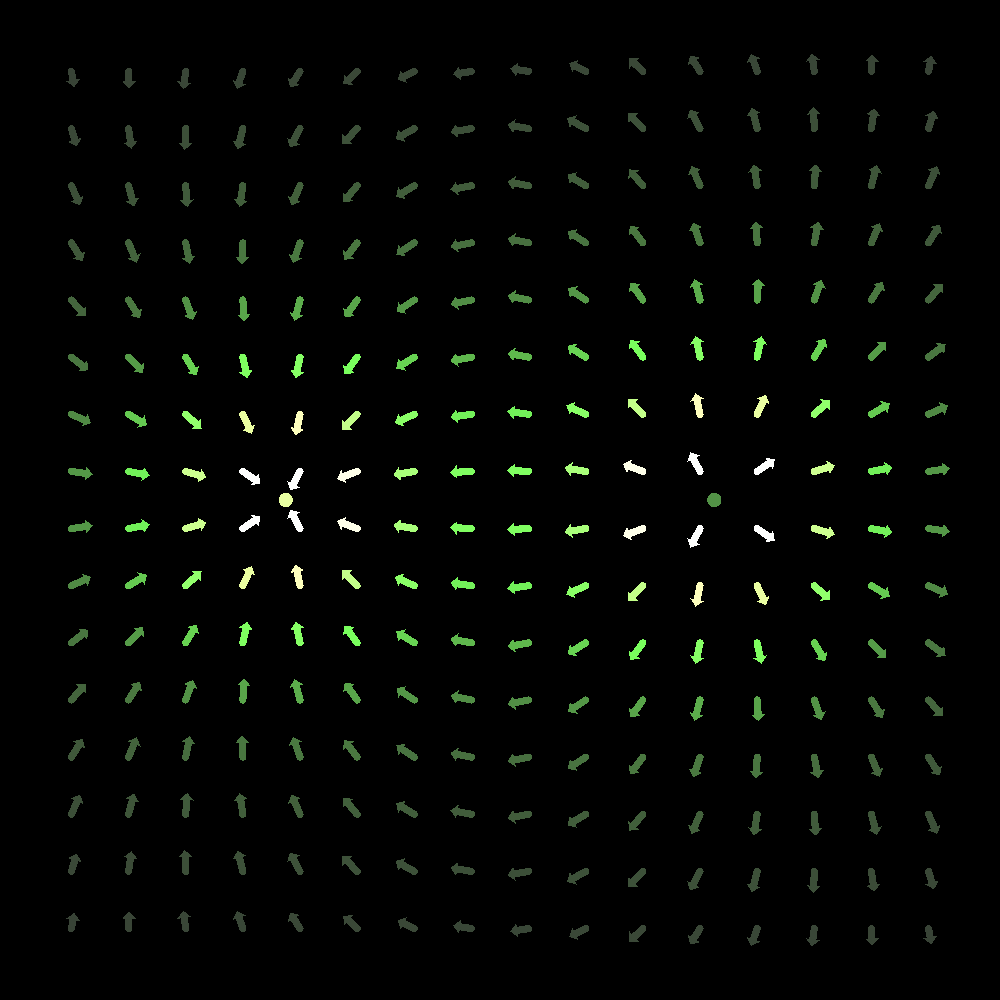

# p5js
A collection of small p5.js projects made for fun.

The projects themselves are contained in individual files, which makes it convenient if you want to copy and run them in the [p5.js editor](https://editor.p5js.org/).

**Please note that these projects were made out of boredom, so no care was put into optimization. *Performance issues* should be expected.**

## Electric field (`electric_field.js`)

An electric field simulation based on [Maxwell's Equations](https://en.wikipedia.org/wiki/Maxwell's_equations). The constants and variables in the code doesn't necessarily follow any conventional SI unit, however the important parts of the equation are kept to depict the shape of the electric field created by negative and positive charges.

The red circle is a "proton" carrying positive charge. The blue circle is an "electron" carrying negative charge. The electric field is then calculated from these two charges, and the result is rendered to the screen as a vector field. The electric field vectors are clamped to a reasonable length, and larger magnitudes are depicted with color instead:

+ Gray:   Lowest
+ Green:  Medium
+ Yellow: High
+ White:  Very high

Below is an image of the simulation running. (`electric_field.png`)

